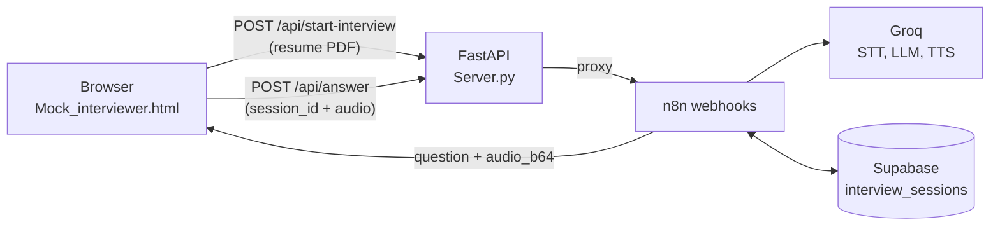
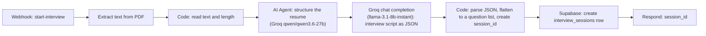
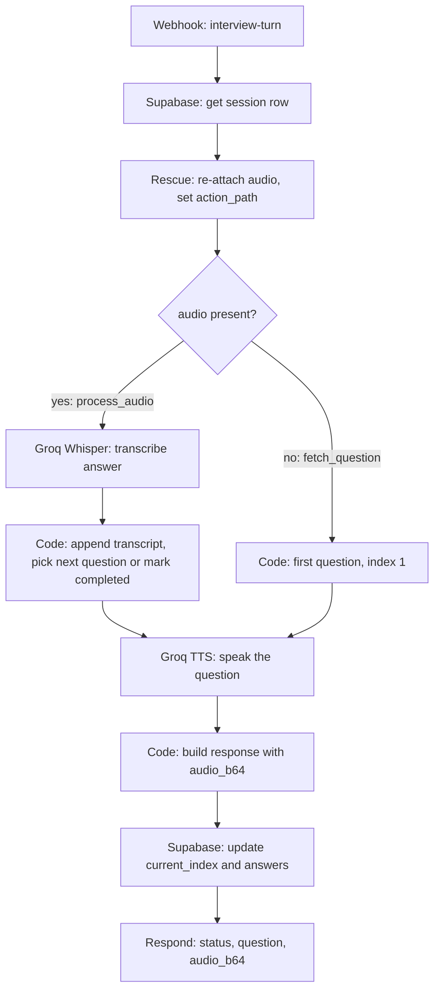
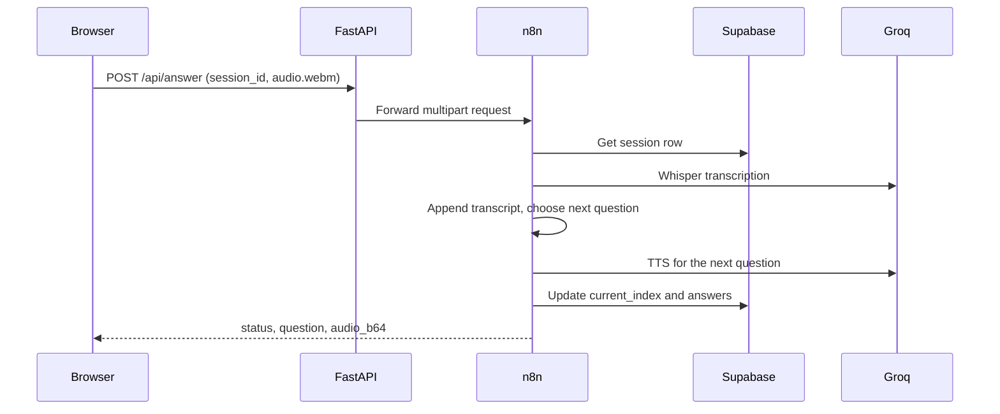

# AI Mock Interviewer

**A voice-first mock interview system that turns a candidate's resume into a personalized technical interview, spoken and answered out loud.**

Upload a resume PDF, and the system generates a tailored interview script, asks each question aloud, transcribes the spoken answer, and moves on to the next question. All session state lives in Supabase, orchestration lives in n8n, and speech and language models run on Groq.

**[Watch the project demo](https://drive.google.com/file/d/1fpyyhkNN7HdJkT3s3unbXFBVZkGQFFOd/view?usp=drivesdk)**

| | |
| --- | --- |
| **Orchestration** | n8n (two webhook workflows, one export) |
| **Backend** | FastAPI proxy in front of the n8n webhooks |
| **Models (Groq)** | `whisper-large-v3-turbo` (speech to text), `llama-3.1-8b-instant` (question generation), `qwen/qwen3.6-27b` (resume structuring), `canopylabs/orpheus-v1-english` (text to speech) |
| **State** | Supabase (`interview_sessions` table) |
| **Frontend** | Single-file HTML, CSS, and JavaScript (MediaRecorder API) |

## Contents

- [Results](#results)
- [How it works](#how-it-works)
- [The n8n workflows](#the-n8n-workflows)
- [Interview design](#interview-design)
- [Session state](#session-state)
- [API reference](#api-reference)
- [Frontend behavior](#frontend-behavior)
- [Engineering notes](#engineering-notes)
- [Project structure](#project-structure)
- [Getting started](#getting-started)
- [Known limitations and roadmap](#known-limitations-and-roadmap)

## Results

Interview analytics from the 8-week run:

| Metric | Result |
| --- | --- |
| Weekly interview volume | from about **15 per week** (manual HR baseline) to about **135 per week** with the AI agent by week 8 |
| Manual HR interviews | dropped from about 15 per week to about 2 per week over the same 8 weeks |
| Session completion rate | **75.0%** completed, 18.3% user abandoned, 6.7% system timeout |
| Response latency by topic | about **1 to 2 seconds**: Python about 0.95 s, SQL and databases about 1.1 s, data structures about 1.45 s, system design about 1.8 s, machine learning about 2.15 s |
| Evaluation score distribution | most sessions scored in the 5 to 8 band (approx. counts: 1-2: 12, 3-4: 45, 5-6: 95, 7-8: 108, 9-10: 40) |

## How it works



1. The candidate uploads a resume PDF.
2. n8n extracts the text, structures it, and asks an LLM for a resume-grounded interview script.
3. The script and an empty answer list are saved as a session in Supabase, and the browser receives a `session_id`.
4. The browser requests the first question. n8n converts it to speech and returns the text plus base64 audio.
5. The candidate records an answer in the browser. n8n transcribes it, stores it, and returns the next question as audio.
6. After the last question, n8n returns `status: "completed"`.

## The n8n workflows

[`AI_Mock_Interviewer.json`](AI_Mock_Interviewer.json) contains two webhook workflows on one canvas (20 nodes).

### Workflow 1: start the interview (`POST /start-interview`)



- The resume is first converted to a fixed template (personal info, education, experience, projects, skills). Missing fields become `Not provided`, and the agent is told to output no conversational filler.
- The question generator returns strict JSON. The Code node strips Markdown fences, parses it, and throws a readable error with the raw output if parsing fails.

### Workflow 2: run one turn (`POST /interview-turn`)



The same webhook serves two purposes. A request without audio fetches question 1. A request with audio records the answer to the previous question and returns the next one.



### Models used

| Stage | Model | Notes |
| --- | --- | --- |
| Resume structuring | `qwen/qwen3.6-27b` | n8n AI Agent node, temperature 0.3, max 1000 tokens |
| Question generation | `llama-3.1-8b-instant` | Groq chat completions over HTTP, JSON output |
| Speech to text | `whisper-large-v3-turbo` | Answer audio uploaded as form data |
| Text to speech | `canopylabs/orpheus-v1-english` | Voice `autumn`, WAV output |

## Interview design

The interview is grounded in the candidate's own resume rather than a generic question bank.

Each script contains up to seven questions, asked in this order:

| Order | Type | Count | Grounding |
| --- | --- | --- | --- |
| 1 | Behavioral | 2 | Scale and context of the stated experience |
| 2 | Project deep-dive | 2 | The two most demanding projects, defending an architectural or algorithmic choice under a realistic constraint |
| 3 | Technical | up to 3 | One question per core skill the resume actually claims, testing limits and trade-offs |

Prompt principles:

1. **Resume-first alignment.** Every question must tie to a specific project, role, or skill the candidate stated. Invented scenarios are forbidden.
2. **Voice-optimized rigor.** Questions are 3 to 4 sentences, phrased as natural spoken dialogue because a voice will read them aloud.
3. **Engineering reality.** Questions push on trade-offs such as latency, memory, scaling, and noisy data.
4. **Structured output.** The model returns only a JSON object (`behavioral_questions`, `project_questions`, `technical_questions`), which the workflow flattens into a plain list of strings.

The prompt carries an internal syllabus so questions stay technically precise across six areas: LLMs, GenAI and RAG; AI agents; machine learning and deep learning; computer vision; embedded systems and mechatronics; and MLOps and deployment.

## Session state

Each interview is one row in Supabase. The generated script is stored once, so it can be reused: entering an existing `session_id` skips resume analysis and replays the same script from question 1 (the answers array is reset).

| Column | Meaning |
| --- | --- |
| `session_id` | Identifier returned to the browser (for example `session_195`) |
| `questions` | Ordered array of question strings |
| `total_questions` | Number of questions in the script |
| `current_index` | Index of the next question to ask |
| `answers` | Array of transcribed answers, in order |

<details>
<summary>Reference schema (reconstructed from the workflow)</summary>

```sql
create table public.interview_sessions (
  session_id text primary key,
  questions jsonb not null default '[]',
  total_questions integer not null default 0,
  current_index integer not null default 0,
  answers jsonb not null default '[]'
);
```

</details>

## API reference

### FastAPI (`Server.py`)

| Endpoint | Body | Description |
| --- | --- | --- |
| `GET /` | none | Serves the web app |
| `POST /api/start-interview` | multipart, field `data` = resume PDF | Forwards to n8n and returns `{ "status": "success", "session_id": "...", "message": "Interview Initialized" }` |
| `POST /api/answer` | form, `session_id` and optional `audio` file | Without `audio`, returns question 1. With `audio`, transcribes the answer and returns the next question |

Response of `POST /api/answer`:

```json
{
  "status": "in_progress",
  "question": "Question text ...",
  "audio_b64": "<base64 WAV>"
}
```

`status` is `completed` after the last answer is stored.

## Frontend behavior

- **Three-step flow:** Upload, Trigger, Interview, with a live stepper.
- **Session reuse:** enter an existing `session_id` to skip resume analysis and save tokens. The interview restarts from question 1.
- **Live waveform states:** speaking, recording, and processing each get their own animation.
- **Recording:** the browser captures `audio/webm` with the MediaRecorder API and posts it with the `session_id`.
- **Voice fallback:** if n8n returns no audio, the app reads the question with the browser's built-in speech synthesis.
- **Completion:** when the last answer is stored, the UI shows a completed state and disables recording.

## Engineering notes

- **Defensive JSON parsing:** LLM output is cleaned of Markdown fences and parsed inside a try/catch that surfaces the raw output in the n8n logs.
- **Transcription failures do not break the interview.** If Whisper fails, the answer is stored as `[Audio received, but transcription failed]` and the interview continues.
- **One webhook, two actions.** A `Rescue` node re-attaches the incoming audio to the session row and sets `action_path` to `process_audio` or `fetch_question`, which lets an `If` node route the turn.
- **Audio without file hosting.** TTS output is returned to the browser as base64, so no storage bucket is needed.
- **Answers are saved every turn.** `current_index` and `answers` are written back to Supabase after each answer, so nothing is lost if the browser tab closes.

## Project structure

```text
.
├── Server.py                     FastAPI app: serves the UI and proxies to n8n
├── Mock_interviewer.html         Single-page frontend
├── AI_Mock_Interviewer.json      n8n workflows (start-interview and interview-turn)
├── AI_Mock_Interviewer.PNG       Screenshot of the n8n workflow canvas
└── README.md
```

## Getting started

### Prerequisites

- Python 3.9+
- An n8n instance
- A Groq API key (configured as an n8n `groqApi` credential)
- A Supabase project with an `interview_sessions` table (schema above) and a Supabase credential in n8n

### 1. Install the backend

```bash
pip install fastapi uvicorn requests python-multipart
```

### 2. Import and activate the workflow

1. In n8n, import [`AI_Mock_Interviewer.json`](AI_Mock_Interviewer.json).
2. Attach your Groq and Supabase credentials.
3. Activate the workflow.

### 3. Point the backend at n8n

| Variable | Default | Purpose |
| --- | --- | --- |
| `N8N_BASE_URL` | `http://127.0.0.1:5678` | Base URL of your n8n instance |
| `N8N_START_WEBHOOK_PATH` | `/webhook-test/start-interview` | Start-interview webhook path |
| `N8N_ANSWER_WEBHOOK_PATH` | `/webhook-test/interview-turn` | Interview-turn webhook path |

The defaults use n8n **test** URLs, which only respond while you click **Execute workflow** in the editor. For a hands-off run, activate the workflow and switch to the production paths:

```bash
export N8N_START_WEBHOOK_PATH=/webhook/start-interview
export N8N_ANSWER_WEBHOOK_PATH=/webhook/interview-turn
```

### 4. Run

```bash
uvicorn Server:app --reload --host 0.0.0.0 --port 8000
```

Open [http://127.0.0.1:8000](http://127.0.0.1:8000), upload a resume PDF, click **Start Interview**, and answer out loud. Microphone access needs `localhost` or HTTPS.

> **Case-sensitive systems (Linux, macOS):** `Server.py` opens `Mock_Interviewer.html`, while the file in this repo is `Mock_interviewer.html`. On Windows this works as is. Elsewhere, either rename the file or change the filename in `Server.py`.

## Known limitations and roadmap

This version uses a fixed question set and stores transcribed answers per session in Supabase. Next steps:

- Bring the scoring and analytics pipeline into this repo: a scoring node that writes rubric-based scores and feedback to Supabase, and the script that generates the dashboard above.
- Adaptive follow-up questions based on the previous answer.
- Resume an interrupted interview from `current_index` instead of restarting, and better handling of audio errors.
- Reduce the 18.3% user-abandonment rate and the 6.7% system-timeout rate.
- Production-ready webhooks and request authentication.

---

Built by [Muhammad Unss Rahim](https://github.com/MUnssRahim).
